<picture>
  <source media="(prefers-color-scheme: dark)" srcset="assets/banner-dark.svg">
  <source media="(prefers-color-scheme: light)" srcset="assets/banner-light.svg">
  
</picture>

 

&nbsp;
&nbsp;

<b>Backend engineer who ships LLM features to production, not prototypes.</b> 
Open to remote AI engineering and backend roles · LatAm / US time zones

<h2 align="center">What I do</h2>

<table align="center">
  <tr>
    <td align="center" width="33%">
      <h3>🤖</h3>
      <b>LLM in production</b> 
      OpenAI function calling wired to real APIs, with retries and rate limits on every model boundary.
    </td>
    <td align="center" width="33%">
      <h3>⚙️</h3>
      <b>Backend systems</b> 
      Node.js, TypeScript and NestJS with Clean Architecture. Go where throughput matters. GCP Cloud Run.
    </td>
    <td align="center" width="33%">
      <h3>🧠</h3>
      <b>Agent-assisted engineering</b> 
      Claude Code and Codex in the daily loop: role-separated subagents, a model tier per role, human review on every change.
    </td>
  </tr>
</table>

<h2 align="center">Featured work</h2>

<table align="center">
  <tr>
    <td width="50%" valign="top">
      <h3>WhatsApp AI agent · FOX Analytics · 2025</h3>
      OpenAI function calling drives the Meta WhatsApp Business API and Google Calendar API as tools. Conversation and scheduling automated end to end, hardened for production.  
      <code>NestJS</code> <code>MySQL</code> <code>OpenAI API</code> <code>Meta API</code>  
      
    </td>
    <td width="50%" valign="top">
      <h3><a href="https://github.com/DANIELSSF/RexBuy">RexBuy</a> · e-commerce</h3>
      Full-stack store with auth and roles, PayPal checkout, cart, reviews, favourites and search.  
      <code>Next.js</code> <code>MongoDB</code> <code>Docker</code>  
      
      
    </td>
  </tr>
  <tr>
    <td width="50%" valign="top">
      <h3>Backend platform · Estrellas App · 2025–</h3>
      TypeScript microservices on GCP Cloud Run with Clean Architecture; MongoDB and PostgreSQL data design; Go services where throughput drives the design.  
      <code>Node.js</code> <code>Go</code> <code>GCP</code> <code>PostgreSQL</code>  
      
    </td>
    <td width="50%" valign="top">
      <h3><a href="https://github.com/DANIELSSF/portfolio">Portfolio</a> · personal site</h3>
      Astro 6 with React islands, custom ES/EN i18n, Tailwind v4 theming and zero JavaScript by default.  
      <code>Astro</code> <code>React</code> <code>Tailwind</code>  
      
      
    </td>
  </tr>
</table>

More: <a href="https://github.com/DANIELSSF/doctors-backend">doctors-backend</a> · <a href="https://github.com/DANIELSSF/todo-list-back">todo-list-back</a> · <a href="https://github.com/DANIELSSF/Pokedex-NestJS">Pokedex-NestJS</a>

<h2 align="center">Stack</h2>

  
  
  

  

  

<h2 align="center">Activity</h2>

<picture>
  <source media="(prefers-color-scheme: dark)" srcset="https://raw.githubusercontent.com/DANIELSSF/DANIELSSF/output/github-snake-dark.svg">
  <source media="(prefers-color-scheme: light)" srcset="https://raw.githubusercontent.com/DANIELSSF/DANIELSSF/output/github-snake.svg">
  
</picture>

  Backend Engineer at <b>Estrellas App</b> · BSc Systems and Computing Engineering, UPTC · Colombia, remote since 2023 
  I integrate and productionize LLMs as a backend engineer. I don't train models.

